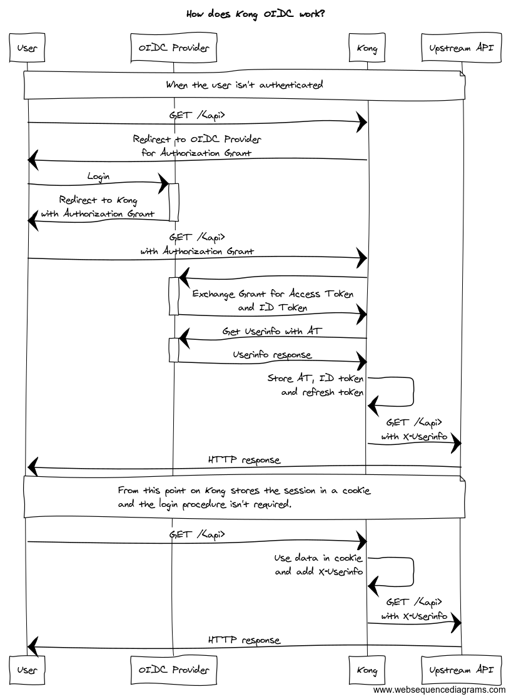

# Introduction

## Overview

The OIDC plugin lets you authenticate users against an OpenID Connect Provider using
[OpenID Connect Discovery](http://openid.net/specs/openid-connect-discovery-1_0.html)
and the Basic Client Profile (i.e. the Authorization Code flow).

It is a plugin for [Kong](https://github.com/kong/kong) implementing the
[OpenID Connect](http://openid.net/specs/openid-connect-core-1_0.html) Relying Party (RP) functionality.

It maintains sessions for authenticated users by leveraging `lua-resty-openidc` thus offering
a configurable choice between storing the session state in a client-side browser cookie or using
one of the server-side storage mechanisms `shared-memory|memcache|redis`.

It can be used as a reverse proxy terminating OAuth/OpenID Connect in front of an origin server so that
the origin server/services can be protected with the relevant standards without implementing those on
the server itself.

The introspection functionality adds capability for already authenticated users and/or applications that
already possess access token to go through kong. The actual token verification is then done by Resource Server.

### How it works

The diagram below shows the message exchange between the involved parties.



The `X-Userinfo` header contains the payload from the Userinfo Endpoint

```json
{
  "preferred_username": "alice",
  "id": "60f65308-3510-40ca-83f0-e9c0151cc680",
  "sub": "60f65308-3510-40ca-83f0-e9c0151cc680"
}
```

The plugin also sets the `ngx.ctx.authenticated_credential` variable, which can be using in other Kong plugins:

```lua
ngx.ctx.authenticated_credential = {
    id = "60f65308-3510-40ca-83f0-e9c0151cc680",   -- sub field from Userinfo
    username = "alice"                             -- preferred_username from Userinfo
}
```

For successfully authenticated request, possible (anonymous) consumer identity set by higher priority plugin is cleared as part of setting the credentials.

The plugin will try to retrieve the user's groups from a field in the token (default `groups`) and set `kong.ctx.shared.authenticated_groups` so that Kong authorization plugins can make decisions based on the user's group membership.

### Get started with the OIDC plugin

To enable the plugin only for one API:

```http
POST /apis/<api_id>/plugins/ HTTP/1.1
Host: localhost:8001
Content-Type: application/x-www-form-urlencoded
Cache-Control: no-cache

"name=oidc&config.client_id=kong-oidc&config.client_secret=29d98bf7-168c-4874-b8e9-9ba5e7382fa0&config.discovery=https%3A%2F%2F<oidc_provider>%2F.well-known%2Fopenid-configuration"
```

To enable the plugin globally:

```http
POST /plugins HTTP/1.1
Host: localhost:8001
Content-Type: application/x-www-form-urlencoded
Cache-Control: no-cache

"name=oidc&config.client_id=kong-oidc&config.client_secret=29d98bf7-168c-4874-b8e9-9ba5e7382fa0&config.discovery=https%3A%2F%2F<oidc_provider>%2F.well-known%2Fopenid-configuration"
```

A successful response:

```http
HTTP/1.1 201 Created
Date: Tue, 24 Oct 2017 19:37:38 GMT
Content-Type: application/json; charset=utf-8
Transfer-Encoding: chunked
Connection: keep-alive
Access-Control-Allow-Origin: *
Server: kong/0.11.0

{
    "created_at": 1508871239797,
    "config": {
        "response_type": "code",
        "client_id": "kong-oidc",
        "discovery": "https://<oidc_provider>/.well-known/openid-configuration",
        "scope": "openid",
        "ssl_verify": "no",
        "client_secret": "29d98bf7-168c-4874-b8e9-9ba5e7382fa0",
        "token_endpoint_auth_method": "client_secret_post"
    },
    "id": "58cc119b-e5d0-4908-8929-7d6ed73cb7de",
    "enabled": true,
    "name": "oidc",
    "api_id": "32625081-c712-4c46-b16a-5d6d9081f85f"
}
```

#### Upstream API request

For successfully authenticated request, the plugin will set upstream header `X-Credential-Identifier` to contain `sub` claim from user info, ID token or introspection result. Header `X-Anonymous-Consumer` is cleared.

The plugin adds a additional `X-Userinfo`, `X-Access-Token` and `X-Id-Token` headers to the upstream request, which can be consumer by upstream server. All of them are base64 encoded:

```http
GET / HTTP/1.1
Host: netcat:9000
Connection: keep-alive
X-Forwarded-For: 172.19.0.1
X-Forwarded-Proto: http
X-Forwarded-Host: localhost
X-Forwarded-Port: 8000
X-Real-IP: 172.19.0.1
Cache-Control: max-age=0
User-Agent: Mozilla/5.0 (Windows NT 10.0; Win64; x64) AppleWebKit/537.36 (KHTML, like Gecko) Chrome/61.0.3163.100 Safari/537.36
Upgrade-Insecure-Requests: 1
Accept: text/html,application/xhtml+xml,application/xml;q=0.9,image/webp,image/apng,*/*;q=0.8
Accept-Encoding: gzip, deflate
Accept-Language: pl-PL,pl;q=0.8,en-US;q=0.6,en;q=0.4
Cookie: session=KOn1am4mhQLKazlCA.....
X-Userinfo: eyJnaXZlbl9uYW1lIjoixITEmMWaw5PFgcW7xbnEhiIsInN1YiI6ImM4NThiYzAxLTBiM2ItNDQzNy1hMGVlLWE1ZTY0ODkwMDE5ZCIsInByZWZlcnJlZF91c2VybmFtZSI6ImFkbWluIiwibmFtZSI6IsSExJjFmsOTxYHFu8W5xIYiLCJ1c2VybmFtZSI6ImFkbWluIiwiaWQiOiJjODU4YmMwMS0wYjNiLTQ0MzctYTBlZS1hNWU2NDg5MDAxOWQifQ==
X-Access-Token: eyJhbGciOiJSUzI1NiIsInR5cCIgOiAiSldUIiwia2lkIiA6ICJGenFSY0N1Ry13dzlrQUJBVng1ZG9sT2ZwTFhBNWZiRGFlVDRiemtnSzZRIn0.eyJqdGkiOiIxYjhmYzlkMC1jMjlmLTQwY2ItYWM4OC1kNzMyY2FkODcxY2IiLCJleHAiOjE1NDg1MTA4MjksIm5iZiI6MCwiaWF0IjoxNTQ4NTEwNzY5LCJpc3MiOiJodHRwOi8vMTkyLjE2OC4wLjk6ODA4MC9hdXRoL3JlYWxtcy9tYXN0ZXIiLCJhdWQiOlsibWFzdGVyLXJlYWxtIiwiYWNjb3VudCJdLCJzdWIiOiJhNmE3OGQ5MS01NDk0LTRjZTMtOTU1NS04NzhhMTg1Y2E0YjkiLCJ0eXAiOiJCZWFyZXIiLCJhenAiOiJrb25nIiwibm9uY2UiOiJmNGRkNDU2YzBjZTY4ZmFmYWJmNGY4ZDA3YjQ0YWE4NiIsImF1dGhfdGltZSI6…IiwibWFuYWdlLWFjY291bnQtbGlua3MiLCJ2aWV3LXByb2ZpbGUiXX19LCJzY29wZSI6Im9wZW5pZCBwcm9maWxlIGVtYWlsIiwiZW1haWxfdmVyaWZpZWQiOmZhbHNlLCJwcmVmZXJyZWRfdXNlcm5hbWUiOiJhZG1pbiJ9.GWuguFjSEDGxw_vbD04UMKxtai15BE2lwBO0YkSzp-NKZ2SxAzl0nyhZxpP0VTzk712nQ8f_If5-mQBf_rqEVnOraDmX5NOXP0B8AoaS1jsdq4EomrhZGqlWmuaV71Cnqrw66iaouBR_6Q0s8bgc1FpCPyACM4VWs57CBdTrAZ2iv8dau5ODkbEvSgIgoLgBbUvjRKz1H0KyeBcXlVSgHJ_2zB9q2HvidBsQEIwTP8sWc6er-5AltLbV8ceBg5OaZ4xHoramMoz2xW-ttjIujS382QQn3iekNByb62O2cssTP3UYC747ehXReCrNZmDA6ecdnv8vOfIem3xNEnEmQw
X-Id-Token: eyJuYmYiOjAsImF6cCI6ImtvbmciLCJpYXQiOjE1NDg1MTA3NjksImlzcyI6Imh0dHA6XC9cLzE5Mi4xNjguMC45OjgwODBcL2F1dGhcL3JlYWxtc1wvbWFzdGVyIiwiYXVkIjoia29uZyIsIm5vbmNlIjoiZjRkZDQ1NmMwY2U2OGZhZmFiZjRmOGQwN2I0NGFhODYiLCJwcmVmZXJyZWRfdXNlcm5hbWUiOiJhZG1pbiIsImF1dGhfdGltZSI6MTU0ODUxMDY5NywiYWNyIjoiMSIsInNlc3Npb25fc3RhdGUiOiJiNDZmODU2Ny0zODA3LTQ0YmMtYmU1Mi1iMTNiNWQzODI5MTQiLCJleHAiOjE1NDg1MTA4MjksImVtYWlsX3ZlcmlmaWVkIjpmYWxzZSwianRpIjoiMjI1ZDRhNDItM2Y3ZC00Y2I2LTkxMmMtOGNkYzM0Y2JiNTk2Iiwic3ViIjoiYTZhNzhkOTEtNTQ5NC00Y2UzLTk1NTUtODc4YTE4NWNhNGI5IiwidHlwIjoiSUQifQ==
```

#### Standard OpenID Connect Scopes and Claims

The OpenID Connect Core 1.0 profile specifies the following standard scopes and claims:

| Scope     | Claim(s)                                                                                                                               |
| --------- | -------------------------------------------------------------------------------------------------------------------------------------- |
| `openid`  | `sub`. In an ID Token, `iss`, `aud`, `exp`, `iat` will also be provided.                                                               |
| `profile` | Typically claims like `name`, `family_name`, `given_name`, `middle_name`, `preferred_username`, `nickname`, `picture` and `updated_at` |
| `email`   | `email` and `email_verified` (_boolean_) indicating if the email address has been verified by the user                                 |

_Note that the `openid` scope is a mandatory designator scope._

#### Description of the standard claims

| Claim                | Type             | Description                                                                                                                                                 |
| -------------------- | ---------------- | ----------------------------------------------------------------------------------------------------------------------------------------------------------- |
| `iss`                | URI              | The Uniform Resource Identifier uniquely identifying the OpenID Connect Provider (_OP_)                                                                     |
| `aud`                | `string` / array | The intended audiences. For ID tokens, the identity token is one or more clients. For Access tokens, the audience is typically one or more Resource Servers |
| `nbf`                | integer          | _Not before_ timestamp in Unix Epoch time\*. May be omitted or set to 0 to indicate that the audience can disregard the claim                               |
| `exp`                | integer          | _Expires_ timestamp in Unix Epoch time\*                                                                                                                    |
| `name`               | `string`         | Preferred display name. Ex. `John Doe`                                                                                                                      |
| `family_name`        | `string`         | Last name. Ex. `Doe`                                                                                                                                        |
| `given_name`         | `string`         | First name. Ex. `John`                                                                                                                                      |
| `middle_name`        | `string`         | Middle name. Ex. `Donald`                                                                                                                                   |
| `nickname`           | `string`         | Nick name. Ex. `Johnny`                                                                                                                                     |
| `preferred_username` | `string`         | Preferred user name. Ex. `johdoe`                                                                                                                           |
| `picture`            | base64           | A Base-64 encoded picture (typically PNG or JPEG) of the subject                                                                                            |
| `updated_at`         | integer          | A timestamp in Unix Epoch time\*                                                                                                                            |

`*` (Seconds since January 1st 1970).

#### Passing the Access token as a normal Bearer token

To pass the access token to the upstream server as a normal Bearer token, configure the plugin as follows:

| Key                               | Value           |
| --------------------------------- | --------------- |
| `config.access_token_header_name` | `Authorization` |
| `config.access_token_as_bearer`   | `yes`           |

## Configuration reference

### Configuration

The OIDC plugin is compatible with the following protocols:

`http`, `https`

### Parameters

Here's a list of all the config parameters which can be used in this plugin's configuration:

#### access_token_as_bearer

`string` | _optional_ | **default** `no`

> Indicates whether the access token should be used as a bearer token.

#### access_token_header_name

`string` | _optional_ | **default** `X-Access-Token`

> The name of the header used to send the access token.

#### bearer_jwt_auth_enable

`string` | _optional_ | **default** `no`

> Whether JWT-based bearer authentication is enabled.

#### bearer_jwt_auth_allowed_auds

`set (string)` | _optional_ |

> The allowed audiences for JWT bearer authentication.

#### bearer_jwt_auth_signing_algs

`set (string)` | _required_ | **default** `RS256`

> The signing algorithms allowed for JWT bearer tokens.

#### bearer_only

`string` | _required_ | **default** `no`

> Specifies whether the service should only accept bearer tokens.

#### client_id

`string` | _required_ |

> The client ID used for authentication.

#### client_secret

`string` | _required_ |

> The client secret used for authentication.

#### discovery

`string` | _required_ | **default** `https://.well-known/openid-configuration`

> The URL for discovering OpenID Connect configuration.

#### disable_access_token_header

`string` | _optional_ | **default** `no`

> Whether to disable the access token header.

#### disable_id_token_header

`string` | _optional_ | **default** `no`

> Whether to disable the ID token header.

#### disable_userinfo_header

`string` | _optional_ | **default** `no`

> Whether to disable the user info header.

#### filters

`string` | _optional_ |

> A list of filters to be applied.

#### groups_claim

`string` | _optional_ | **default** `groups`

> The claim representing user groups.

#### header_claims

`set (string)` | _required_ | **default** `{}`

> A list of claims that should be included in the headers.

#### header_names

`set (string)` | _required_ | **default** `{}`

> The names of headers that should be included in the request.

#### https_proxy

`string` | _optional_ |

> The HTTPS proxy server to use.

#### http_proxy

`string` | _optional_ |

> The HTTP proxy server to use.

#### ignore_auth_filters

`string` | _optional_ |

> A flag indicating whether authentication filters should be ignored.

#### introspection_cache_ignore

`string` | _required_ | **default** `no`

> Whether the introspection cache should be ignored.

#### introspection_endpoint

`string` | _optional_ |

> The endpoint used for introspection of tokens.

#### introspection_endpoint_auth_method

`string` | _optional_ |

> The authentication method used for introspection endpoint.

#### logout_path

`string` | _optional_ | **default** `/logout`

> The URL path to redirect to after logout.

#### post_logout_redirect_uri

`string` | _optional_ |

> The URI to redirect to after logout.

#### realm

`string` | _required_ | **default** `kong`

> The realm or domain for authentication.

#### recovery_page_path

`string` | _optional_ |

> The path for the recovery page.

#### redirect_after_logout_uri

`string` | _optional_ | **default** `/`

> The URI to redirect to after logout.

#### redirect_after_logout_with_id_token_hint

`string` | _optional_ | **default** `no`

> Whether to include an ID token hint after logout.

#### redirect_uri

`string` | _optional_ |

> The URI where the user should be redirected.

#### revoke_tokens_on_logout

`string` | _optional_ | **default** `no`

> Whether tokens should be revoked upon logout.

#### scope

`string` | _required_ | **default** `openid`

> The scope of the request, typically used for authentication.

#### session_check_addr

`string` | _optional_ | **default** `no`

> Whether to check the user's IP address during session validation.

#### session_check_scheme

`string` | _optional_ | **default** `yes`

> Whether to check the protocol scheme during session validation.

#### session_check_ssi

`string` | _optional_ | **default** `no`

> Whether to check the session state index during session validation.

#### session_check_ua

`string` | _optional_ | **default** `yes`

> Whether to check the user agent during session validation.

#### session_secure

`string` | _optional_ | **default** `no`

> Whether the session should be marked as secure.

#### session_secret

`string` | _optional_ |

> The secret used to encrypt session data.

#### session_samesite

`string` | _optional_ |

> The SameSite policy for session cookies.

#### ssl_verify

`string` | _required_ | **default** `no`

> Whether SSL verification is enabled.

#### timeout

number | _optional_ |

> The timeout value for the session or connection.

#### token_endpoint_auth_method

`string` | _required_ | **default** `client_secret_post`

> The authentication method used at the token endpoint.

#### unauth_action

`string` | _optional_ | **default** `auth`

> The action to take when a user is not authenticated.

#### use_jwks

`string` | _required_ | **default** `no`

> Whether to use JWKS (JSON Web Key Set) for key management.

#### use_nonce

`string` | _required_ | **default** `no`

> Whether to use a nonce during authentication.

#### use_pkce

`string` | _required_ | **default** `no`

> Whether to use PKCE (Proof Key for Code Exchange) during authentication.

#### userinfo_header_name

`string` | _optional_ | **default** `X-USERINFO`

> The name of the header that contains user information.

#### validate_scope

`string` | _required_ | **default** `no`

> Whether the scope should be validated.

## Using the plugin

Example below uses the `deck` CLI for configuring Kong.

```yaml
services:
- name: oidc-test
  url: https://httpbin.org
  routes:
  - name: oidc-test
    hosts:
    - localhost
  plugins:
  - name: oidc
    config:
      discovery: https://<KEYCLOAK>/.well-known/openid-configuration
      client_id: ""
      client_secret: ""
```

Run the deck command passing the above config into stdin: `deck sync --state -`

Go to: http://localhost:8000/headers

## Changelog

### Version 1.5.0-1

- Refresh README
- Removed any scripting that did the build
- Add integration testing using Playwright

> This code is based on https://github.com/ikethecoder/kong-oidc.git and all commit history from that repo has been preserved for proper credit.

**Credits:**

```
Adam Płaczek <trojan295@gmail.com>
Damian Czaja <damian.czaja@nokia.com>
Geoff Kassel <geoff.kassel@biarri.com>
Gergely Csatari <gergely.csatari@nokia.com>
Hannu Laurila <hanlaur@writeread.net>
Joshua Erney <trojan295@gmail.com>
Lars Wilhelmsen <lars@sral.org>
Luka Lodrant <trojan295@gmail.com>
Micah Silverman <micah@afitnerd.com>
Michal Kulik <michal.kulik@nokia.com>
Nazarii Makarenko <trojan295@gmail.com>
Pavel Mikhalchuk <trojan295@gmail.com>
pekka.hirvonen <pekka.hirvonen@nokia.com>
The Gitter Badger <trojan295@gmail.com>
Tom Milligan <trojan295@gmail.com>
Trojan295 <trojan295@gmail.com>
Tuomo Syrjanen <tuomo.syrjanen@nokia.com>
Yoriyasu Yano <trojan295@gmail.com>
Yuan Cheung <trojan295@gmail.com>
```
